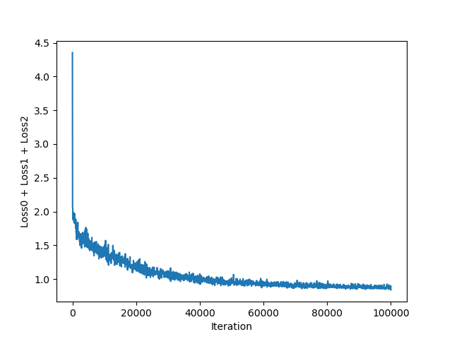
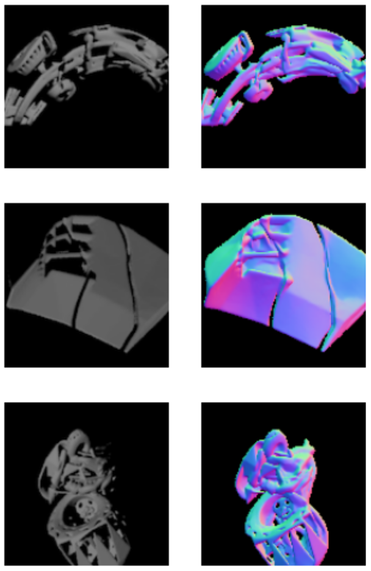
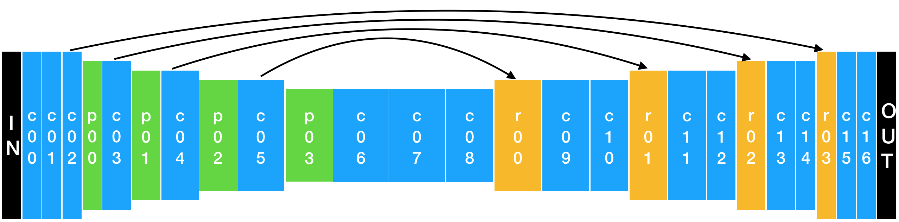
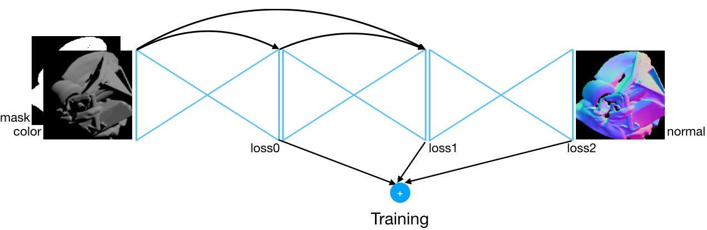

# EECS442-Challenge-Surface-Normal-Estimation

by Team deepEye (Shen Su, Mengyi Sun, Yichen Wang, Wenzhe Xu)

Keywords: CNN, Hourglass net, Surface Normals

## Network Architectures

Base Architecture: Hourglass Network
To improve performance:

* Inception Modules
* Stack Hourglasses

Finally, a Triple-Stack hourglass network is adoped.

The training loss is shown below.



Three of 2000 test image results are attached below.



Comparison of different networks:

```
Network Architecture we tried    Training loss (nearly converged)    Test Loss (evaluation server submission)
------------------------------------------------------------------------------------------------------------

1 hourglass with inception       Loss0 = 0.601409                    0.6936
2 hourglasses with no incep.     Loss0 + Loss1 = 0.613517            0.4951
3 hourglasses with no incep.     Loss0 + Loss1 + Loss2 = 0.841395    0.4475
```

## Details of Triple-Stack Hourglass
#### One stack layout is shown below.



`c`: Convolution Layer

`p`: Max Pooling Layer

`r`: Upsampling Layer

`solid arrow line`: Concatenation

Conv. Output Depth: [64, 128, 256, 512, 1024]

#### Triple Stack Structure is shown below.



`stack0 input`: netIN ("color" + "mask")

`stack0 output`: out0

`stack1 input`: [out0, netIN]

`stack1 output`: out1

`stack2 input`: [out1, out0, netIN]

`stack2 output`: out2

#### Training details:
* Minimize the total mean angle error (MAE) = loss(out0) + loss(out1) + loss(out2)
* Optimizer: `tf.train.AdamOptimizer()`
* Loss Calculation: Taylor expansion of "arccos" is used instead of `tf.acos()` due to numerical instability
* Batch size: 20; Training Steps: 100,000

## Reference
Newell, A., Yang, K. and Deng, J., 2016, October. Stacked hourglass networks for human pose estimation. In *European Conference on Computer Vision* (pp. 483-499). Springer, Cham.

Chen, W., Fu, Z., Yang, D. and Deng, J., 2016. Single-image depth perception in the wild. In Advances in *Neural Information Processing Systems* (pp. 730-738)

#### Library
`Tensorflow`, `numpy`, `skimage`, `matplotlib`, `PIL`

#### Device
GTX 1080 Ti (training about 13 hours)

#### Future Work Recommendation
Try more stacks of hourglass nets
